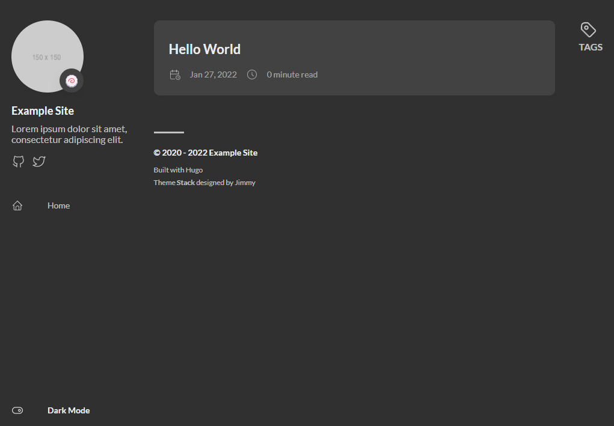

# 前言

工作繁忙 ~~偷懶~~ 的關係讓原先的部落格閒置許久都沒有更新，之前我是購買 [Sugarhosts](https://www.sugarhosts.com/zh-tw/) 的 Web Hosting 服務，但想著自己的使用需求降低後似乎可以把續約的費用省下來做其他事情 ~~買更多酷東西~~。最近又閒得發慌想找事情來過過手癮，正好藉著這個機會來玩最近很紅的 [GitHub Actions](https://github.com/features/actions)。

<!--more-->

其實先前部落格已使用過許多不同的方案:
- [Wordpress](https://tw.wordpress.org/)
- [Hexo](https://hexo.io)
- [Hugo](https://gohugo.io/)

[Hexo](https://hexo.io) 與 [Hugo](https://gohugo.io/) 這種產生靜態網站的方案優點是瀏覽的流暢度快到無話可說，不像動態編譯語言可能會受到伺服器當前的負載而影響速度，缺點則是每次異動都需「編譯」再將檔案「部屬」至伺服器。
[Wordpress](https://tw.wordpress.org/) 功能非常豐富自訂性也非常高，也有許多好用的成熟插件可以使用，缺點就是非常肥還必須有 [PHP](https://www.php.net/) 與 [MySQL](https://www.mysql.com/) 環境才能使用。採用 Self-Hosting 會有不少維運成本；Cloud-Hosting 雖省去了不少維運成本，但卻會讓能換成喜歡東西的錢錢不見。


# 開始動手

## 沒有計畫，就是最好的計畫
根據之前跳來跳去的經驗，最麻煩的事情其實是遷移既有文章最讓人頭痛。[Wordpress](https://tw.wordpress.org/) 寫文章時是靠著它提供的所見及所得的線上編輯器並不相容於 [Markdown](https://markdown.tw/) 語法，坊間有不少轉換的工具可以將資料讀取出來轉換成 MD 格式，但都有不少的相容性問題要人工介入處理，所以這次我決定痛斷捨離重新開始，順便也想讓自己的文章品質有個分界線，畢竟之前的文章都是隨筆居多對讀者來說並不友善，這次打算改過自新好好地寫文章。


## 工欲善其事，必先利其器
這次的組合如下：
- [Hugo](https://gohugo.io/)  
選擇 Hugo 單純是工作上有用到 Golang 所以想說如果到時候真的功能不足需要客製化可以下海改。
- [GitHub Page](https://pages.github.com/)  
免費 ~~可白嫖~~ 的靜態網頁託管服務，省去自己維護伺服器的麻煩。
- [GitHub Actions](https://github.com/features/actions)  
本次 Coding for Fun 的主角，免費方案提供了 2,000 分鐘/月 的額度，以我的部落格更新頻率絕對是夠的。

[Hugo](https://gohugo.io/) 的官方文件有寫了非常多種安裝方法，這邊我選擇 `go install` 的方式安裝：
1. 從 [GitHub](https://github.com/) 上將 [Hugo](https://github.com/gohugoio/hugo#fetch-from-github) 的專案 Clone 下來
2. 輸入 `go install --tags extended` 即可將 [Hugo](https://gohugo.io/) 安裝到 `$GOROOT/bin`
    - `--tags extended` 是為支援 Sass/SCSS 格式的 CSS Preprocessor (許多 theme 都依賴此功能)
3. 建立網站只需要執行 `hugo new site shuangrain.github.io -f yml` 就可以看到當前目錄多個 `shuangrain.github.io` 的資料夾
    -  `-f yml` 是指定 config 檔案的格式為 yaml (預設為 toml)
4. 進入剛剛新增的資料夾後執行 `hugo new posts/hello-world.md` 就可以在 `./content/posts/hello-world.md` 找到新建立的檔案

## 佛要金裝，人要衣裝
剛剛介紹完如何安裝 [Hugo](https://github.com/gohugoio/hugo#fetch-from-github) 與建立網站，但目前網站還是白茫茫的什麼都沒有，必須先讓它穿上漂亮的表皮才能見人，官方網站有提供[更衣間](https://themes.gohugo.io/)供各位客官挑選，這邊我選擇的是 [Hugo Theme Stack](https://github.com/CaiJimmy/hugo-theme-stack) 這套衣服。

我選擇使用 [Git Submodule](https://git-scm.com/book/en/v2/Git-Tools-Submodules) 安裝：
1. 將剛剛建立出來的資料夾初始化
```text
git init
```
2. 使用 [Git](https://git-scm.com/) 命令下載主題
```text
git submodule add https://github.com/CaiJimmy/hugo-theme-stack/ themes/hugo-theme-stack
```
3. 複製該專案的 [`exampleSite/config.yaml`](https://github.com/CaiJimmy/hugo-theme-stack/blob/master/exampleSite/config.yaml) 的內容至自己的 `config.yml` 裡面
4. 再來需要修改剛剛複製的內容以順利偵測文章路徑，找到下面的字段後將 `post` 修改為 `posts`
```text
params:
    mainSections:
        - post
```
5. 最後就可以用 `hugo server --buildDrafts` 看到剛剛新增的文章



# 總結
這套解決方案非常容易上手，沒有過多的複雜設定也有支援熱加載的功能，有任何修改都可以即時在網頁上反應。下個文章再來分享如何部屬到 [GitHub Page](https://pages.github.com/) 給大家。